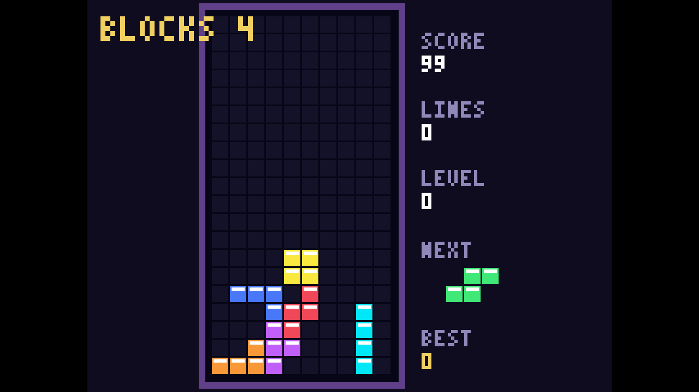

# Blocks 4 WAT

Blocks 4 is a complete falling-block puzzle game written directly in
WebAssembly text format. It renders a crisp pixel-art playfield in a true
1280×720 framebuffer and produces its music and sound effects inside the Wasm
module.

## Play it now:
```
npx wasmcart https://raw.githubusercontent.com/wasmcart/blocks4-wat/main/blocks4-wat.wasc
```



## Build, run, and test

```sh
./build.sh
npx wasmcart ./blocks4-wat.wasc
node test.mjs
```

The build script uses WABT through `npx` to compile `game.wat` into
`game.wasm`, then packages the module as `blocks4-wat.wasc`.

## Controls

| Action | Controller | Keyboard |
| --- | --- | --- |
| Move | D-pad Left/Right | Left/Right or A/D |
| Soft drop | D-pad Down | Down or S |
| Rotate clockwise | A or D-pad Up | X, Space, Up, or W |
| Rotate counter-clockwise | B, X, or Y | Z |
| Pause | Start | Enter |
| Restart after game over | A | X or Space |

Down accelerates normal descent. No face button instantly drops or locks a
piece.

## Gameplay

Blocks 4 includes a seven-bag randomizer, all seven tetrominoes, clockwise and
counter-clockwise rotation, wall kicks, a 30-frame lock delay, ghost piece,
next-piece preview, soft-drop scoring, standard single/double/triple/Tetris
line scoring, increasing levels, and persistent best-score storage.

The original stereo soundtrack has separate lead, bass, and arpeggio voices.
Rotation, line clears, pausing, and game-over states add independent sound
effects without interrupting the music.

The test suite validates the wasmcart ABI, 1280×720 output, seven-bag behavior,
both rotation directions, wall kicks, lock delay, soft drop, line clearing,
restart behavior, and audio. It also completes a controller-driven 30-piece
playthrough using the public input ABI.
